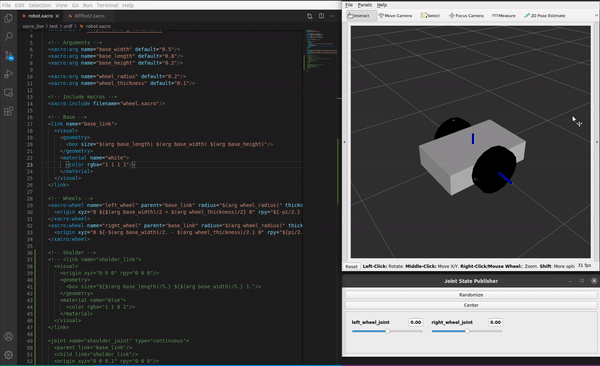

# xacro_live

Tool to update the robot_description dynamically from updates on a target xacro file.

## How it works

To start tracking a xacro file and its children, simply run:

```
ros2 run xacro_live xacro_live path/to/target.xacro
```

Then, whenever you modify any of the files of the urdf tree, a request to change the `robot_description` param is sent to `robot_state_publisher` node.

__IMPORTANT NOTE:__To track the files in the source folder, you must run `colcon build` with the `--symlink-install` flag, otherwise it will track the files installed.

The package also provides the helper launch file `xacro_live_view.launch`:

```
ros2 launch xacro_live xacro_live_view.launch.py xacro_file:="path/to/target.xacro"
```



It runs `xacro_live`, `robot_state_publisher`, `joint_state_publisher_gui`, and `rviz2`, so the user can see the updates happening while editing the robot description files (it is up to the user to open the xacro files with its favourite editor).
